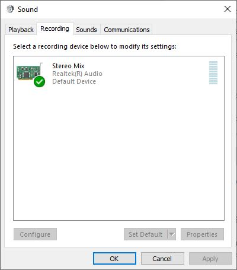

EBS 반디 레코딩 Tools

ffmpeg.exe가 필요합니다.

[이곳에서](https://www.ffmpeg.org/) 다운로드 받으실 수 있습니다.

```shell
recRun.bat 7200 
```

두시간 동안 녹음을 진행한 후 자동으로 종료합니다.

숫자는 초를 의미합니다.

- 10분은 600
- 1시간은 3600
- 2시간은 7200 입니다

현재 작업 디렉토리는 ```D:\Record\ffmpeg\bin\``` 입니다.

녹음 파일의 저장위치는 MP3_FILE_NAME의 내용을 수정하시면 됩니다.

```
SET MP3_FILE_NAME="D:\Record\REC_%fullstamp%.mp3"
```

ffmpeg 파일의 정확한 위치를 알려주어야 합니다.

```
D:\Record\ffmpeg\bin\ffmpeg -t %RECORDING_SECS% -y -f dshow -i audio=%DEVICE_NAME% %MP3_FILE_NAME%
```

```shell
runBandiFirefox.exe
```

레코딩을위해서 "Stereo Mix"가 Enable되어 있어야 합니다.


